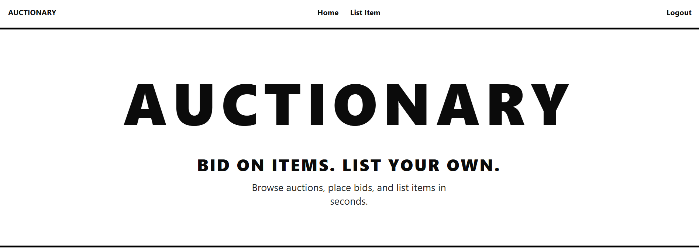
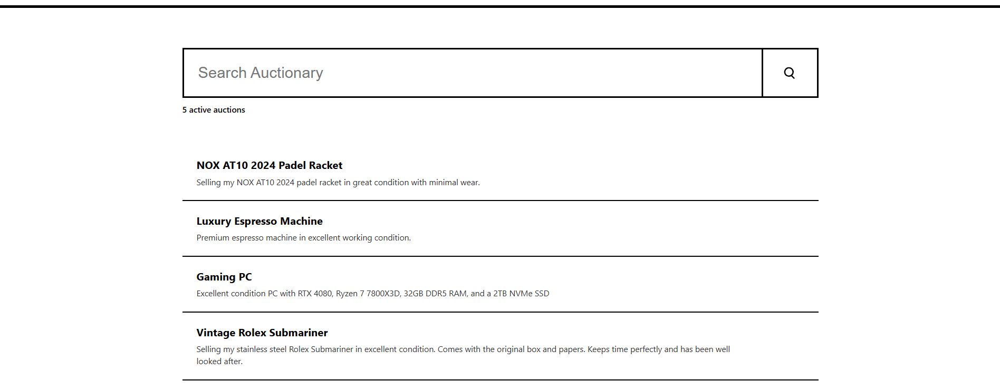
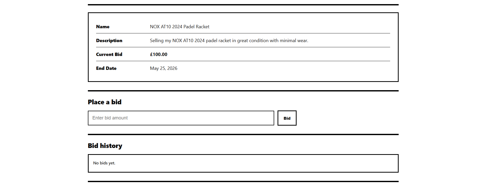
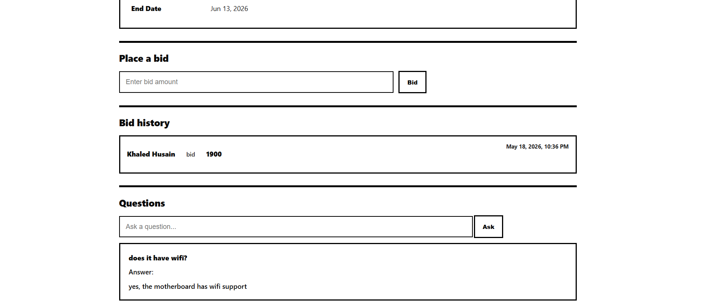
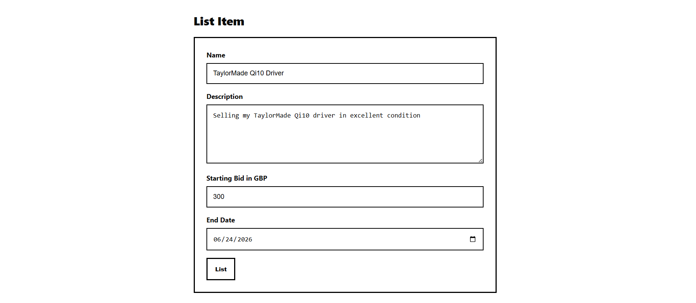

# Auctionary

**A full-stack auction platform with secure user authentication, live bidding logic, item management, and REST API architecture.**

---

## Overview

Auctionary is an online auction platform where users register accounts, list items for auction, place bids, and interact with sellers through a question-and-answer flow. The Vue frontend consumes a Node.js REST API backed by SQLite, with most business rules enforced on the server.

The project emphasizes **backend architecture**: REST endpoint design, request validation, relational data modelling, and session authentication. Primary development focus areas include API architecture, validation systems, database logic, and authentication.

---

## Key Features

- **User account creation and login**: registration with password rules; email/password sign-in
- **Session-based authentication**: server-issued session tokens via `X-Authorization` header
- **Auction item creation**: authenticated sellers create listings with starting bid and end date
- **Bidding system**: authenticated users place bids; highest bid tracked per item
- **Bid validation**: minimum increment, no self-bidding, closed-auction checks
- **Auction end-date handling**: bids rejected after `end_date`; listings searchable by status when authenticated
- **Question and answer system**: buyers ask questions; item owners post answers
- **Item search**: public keyword search with debounced frontend queries
- **Bid history**: per-item bid timeline with bidder names and timestamps
- **User profiles**: view user details with created items and bid activity
- **REST API architecture**: resource-oriented routes with consistent JSON error responses
- **SQL database persistence**: SQLite with foreign keys across users, items, bids, and questions
- **Input validation and error handling**: Joi schemas on controllers; structured `error_message` payloads

---

## Tech Stack

| Layer | Technologies |
|--------|----------------|
| **Frontend** | Vue 3, Vue Router, Vite |
| **Backend** | Node.js, Express |
| **Database** | SQLite (`sqlite3`) |
| **Authentication** | PBKDF2 password hashing; session tokens stored on `users.session_token` |
| **Tools / Libraries** | Joi (validation), `body-parser`, CORS, Morgan (logging), Nodemon (dev) |

---

## Screenshots

### Landing page



### Browse auctions

Search and active listings on the home view.



### Item details

Single listing with current bid, end date, and bid form.



### Bidding and questions

Bid history, place a bid, ask questions, and seller answers.



### List an item

Create a new auction listing (authenticated).



---

## System Architecture

The application follows a classic three-tier flow: the Vue SPA calls the Express API, which reads and writes to a local SQLite database. Authenticated requests attach the session token in the `X-Authorization` header; middleware resolves the token to a user ID before protected handlers run.

---

## Core Systems

### Authentication System

New users are registered via `POST /users`. Passwords are hashed with PBKDF2 and a per-user salt. On login, a random hex session token is stored on the user row and returned to the client. Protected routes use middleware that validates `X-Authorization` and attaches `authenticatedUserID` to the request. Logout clears the token in the database.

### Auction & Bidding Logic

Sellers create items with name, description, starting bid, and a future end date. Bidders submit amounts greater than the current highest bid (or starting bid if none). The API blocks bidding on closed auctions, on the seller's own listings, and when the amount is not strictly higher than the current leading bid. Item detail and search endpoints expose current bid and seller information.

### Validation & Error Handling

Controllers validate params, query strings, and bodies with Joi before touching the database. Failures return `400` with `{ "error_message": "..." }`. Authorization failures use `401`/`403`; missing resources use `404`; unexpected DB errors use `500`.

### Database Persistence

SQLite tables model users, items, bids, and questions with foreign-key relationships. Bids use a composite primary key on `(item_id, user_id, amount)`. Email is unique on users. The database file is created automatically on first server start (`db.sqlite`).

---

## API Overview

**Base URL:** `http://localhost:3333`

**Authenticated requests:** `X-Authorization: <session_token>`

| Method | Endpoint | Auth | Description |
|--------|----------|------|-------------|
| `GET` | `/` | No | Health check (`{ "status": "Alive" }`) |
| `POST` | `/users` | No | Register a new user |
| `POST` | `/login` | No | Log in; returns `user_id` and `session_token` |
| `POST` | `/logout` | Yes | Invalidate session token |
| `GET` | `/user/:user_id` | No | Get user profile, listed items, and bids |
| `GET` | `/search` | Partial* | Search items (`q`, optional `status`, `limit`, `offset`) |
| `POST` | `/item` | Yes | Create a new auction listing |
| `GET` | `/item/:item_id` | No | Get item details and current bid |
| `POST` | `/item/:item_id/bid` | Yes | Place a bid |
| `GET` | `/item/:item_id/bid` | No | List bid history for an item |
| `GET` | `/item/:item_id/question` | No | List questions for an item |
| `POST` | `/item/:item_id/question` | Yes | Ask a question on an item |
| `POST` | `/question/:question_id` | Yes | Answer a question (item owner only) |

\* `status` filter (`OPEN`, `BID`, `ARCHIVE`) requires a valid `X-Authorization` token.

---

## Database Overview

| Table | Purpose |
|-------|---------|
| **users** | Accounts: name, unique email, password hash, salt, optional `session_token` |
| **items** | Auction listings: name, description, bids, dates, `creator_id` -> users |
| **bids** | Bid records: `item_id`, `user_id`, `amount`, `timestamp` |
| **questions** | Q&A: question text, optional answer, `asked_by`, `item_id` |

**Relationships**

- Items belong to a creator (`items.creator_id` -> `users.user_id`)
- Bids reference both an item and a bidder
- Questions reference the item and the asking user

**Constraints (application-enforced unless noted)**

- Unique email on registration (DB unique constraint)
- End date must be in the future when creating an item
- Bids must exceed the current highest amount; auctions closed after `end_date`
- Only non-owners may bid or ask questions; only the item owner may answer

---

## Installation

### Prerequisites

- Node.js (LTS recommended)
- npm

### 1. Clone the repository

```bash
git clone https://github.com/khaledhusain/Auctionary
cd Auctionary
```

### 2. Install dependencies

**Backend (project root):**

```bash
npm install
```

**Frontend:**

```bash
cd frontend
npm install
cd ..
```

### 3. Run the backend

```bash
node server.js
```

Or with auto-reload:

```bash
npm run dev
```

API runs at **http://localhost:3333**. On first start, SQLite creates `db.sqlite` and required tables.

### 4. Run the frontend

```bash
cd frontend
npm run dev
```

App runs at **http://localhost:5173** (Vite default).

---

## Future Improvements

- Real-time bidding with WebSockets
- Email or in-app notifications for outbid events and auction endings
- Advanced search, filters, and sorting
- Richer user profiles and avatars
- Production deployment (containerised API, managed DB, CI/CD)
- Polished UI/UX and responsive design pass
- Auction analytics and seller dashboards

---

## Project Status

This project is maintained as a **portfolio example** of a backend-focused full-stack auction platform, demonstrating REST API design, validation, and persistence.
